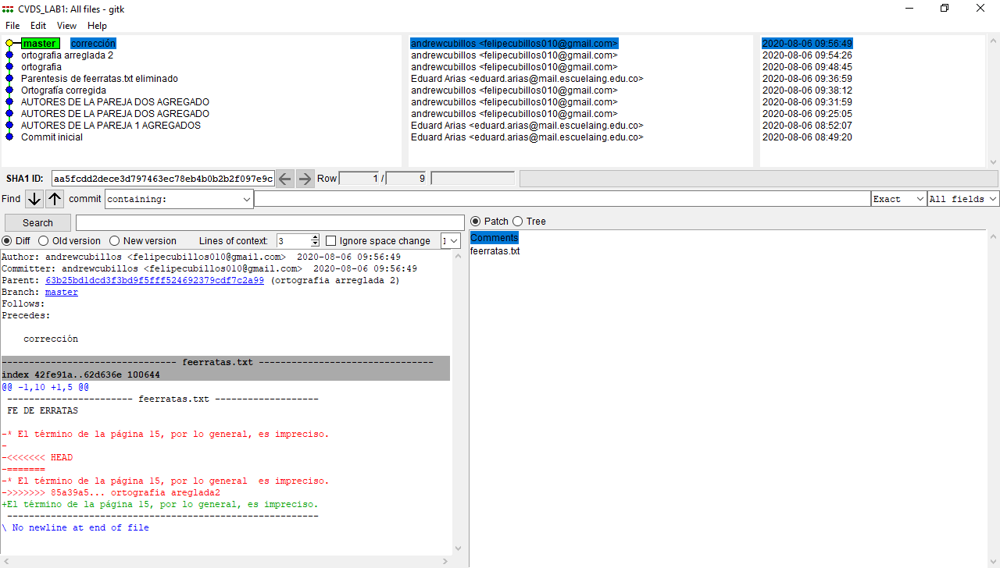

# PARTE 1

1. Pareja 1: Eduard Arias y Felipe Marin. Pareja 2: Brayan Buitrago y Andrés Cubillos.
2. En la parte del conflicto, la pareja 2 quedó como la versión oficial. La pareja 1 debió resolver conflictos antes de hacer su respectivo "git push".
3. 
